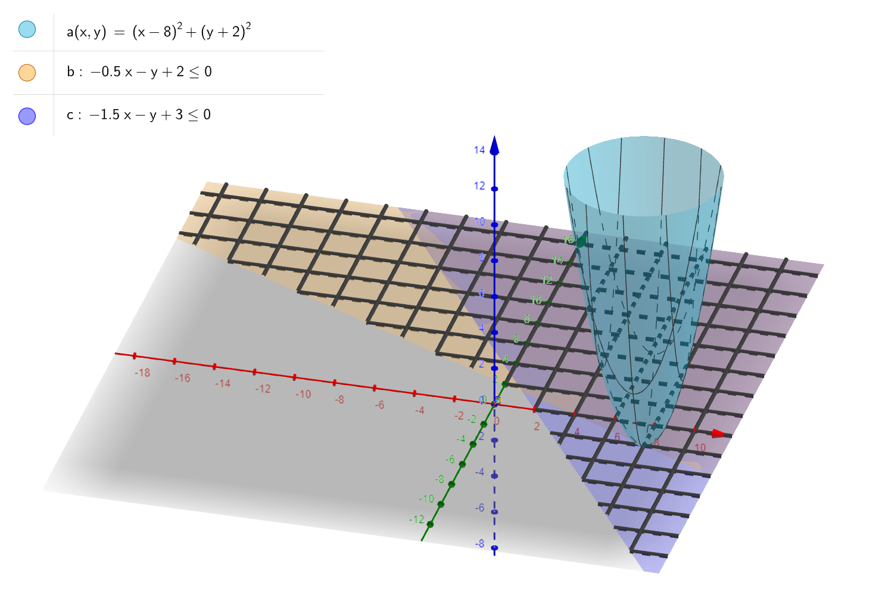
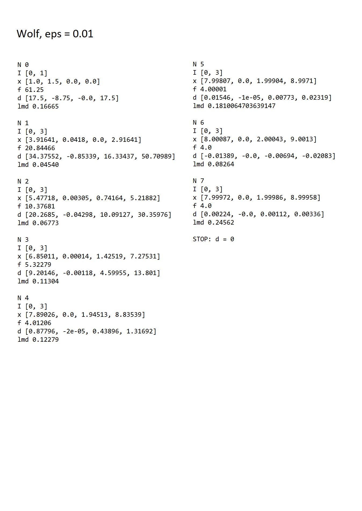
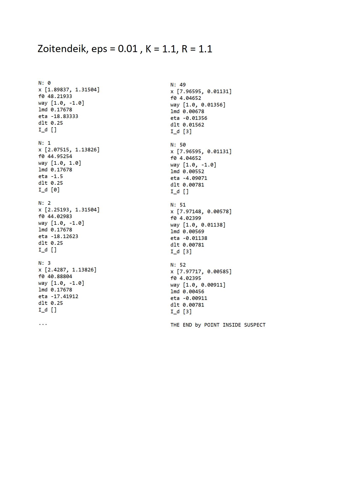
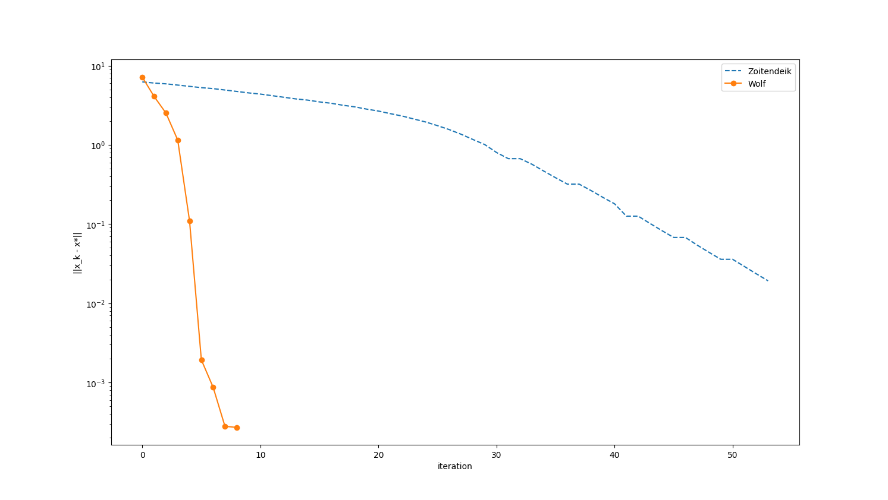

## Reduced gradient method

- [Reduced gradient method](#reduced-gradient-method)
  - [Description](#description)
  - [Get started](#get-started)
  - [Project structure](#project-structure)
  - [Results](#results)

### Description

1. It is necessary to minimize the function of two variables:

$\varphi(x) = (x_0-8)^2 + (x_1 + 2)^2$ -> $min$

2. Provided that linear equalities are met:
    - $-0.5 x_0 - x_1 + x_2 + 2 = 0$ 
    - $-1.5x_0 - x_1 + x_3 + 3 = 0$
    - $-x_i \leq 0$, $i \in [0,3]$
  
3. The problem is solved by the Wolfe method (the method of the reduced gradient)
4. Compare on a given example the Wolfe method and the Zoitendijk method (the method of possible directions)



### Get started
```bash
git clone https://github.com/IMZolin/reduced-gradient-method <your project name>
cd <your project name>
pip install -r requirements.txt
```

### Project structure
```bash
├───graphics            # images:graphics+scheme of simplex
├───report
│   └───lab3_opt_methods.pdf 
├───src                 # code
│   ├───golden_egg.py      # Golden Ratio Method
│   ├───main.py  # corner dots 
│   ├───One_D_Problem_file.py # one dimension minimization problem class
│   ├───result_analisys.py  # get results
│   ├───test_uniform.py # test code for running uniform search method
│   ├───result_analisys.py # get results
│   ├───Trial_Point_Method_file.py # Trial Point Method
└───────uniform_search.py # Uniform Search Method
```

### Results

1. Solution of Wolf method

2. Solution of Zoitendeik method

3. Comparison of methods

